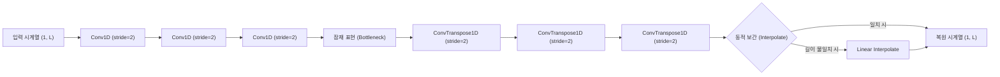

# 비지도 학습 기반 시계열 이상치 탐지 연구 보고서
**연구 주제**: 1D Convolutional Autoencoder를 활용한 다차원 시계열 이상치 탐지 모델 설계 및 통계적 임계값 선정 방법론 비교

---

## 1. 서론 (Introduction)
본 연구는 라벨링이 불가능하거나 극히 희소한 시계열 이상치 탐지(Anomaly Detection) 환경을 극복하기 위해, **정상 데이터만을 학습(Semi-supervised/Unsupervised)하는 딥러닝 기반 오토인코더(Autoencoder)** 아키텍처를 설계하고 다양한 통계적 임계치(Threshold) 설정 기법들의 유효성을 벤치마크 평가하여 최적의 방법론을 제시하는 것을 목적으로 한다.

---

## 2. 실험 환경 및 데이터베이스 구축 (Dataset & DB Construction)
연구의 객관성 및 일반성 확보를 위해 UCR 시계열 분류 아카이브(UCR Time Series Archive)의 One-vs-All 변환 서브셋 및 Hugging Face 고래 소리 탐지 데이터셋(`CornellWhaleChallenge`)을 통합 적재한 SQLite 데이터베이스(`univariate_ts.db`)를 구축하였다.

* **이상치 비율 통제**: 실제 서비스 및 산업 현장의 희소 이상치 조건을 반영하기 위해 테스트 데이터셋(`TEST`) 내의 이상치 비율을 **정밀하게 2% 수준으로 다운샘플링**하여 통제하였다.
* **학습 세트 무결성**: 학습 데이터셋(`TRAIN`)은 100% 정상(Normal) 데이터로만 정밀 구성하였다.
* **Z-Score 정규화**: 입력값의 진폭 차이로 인한 그라디언트 폭주를 막기 위해 인스턴스 단위 Z-Score 정규화($\mu=0, \sigma=1$)를 전처리 과정으로 필수 적용하였다.
* **평가 대상 규모**: 초기 대조 실험은 **947개** 데이터셋 기준으로 수행하였고, 데이터베이스 확장 및 정합성 보정 이후 최신 전수 평가는 제외 대상(`CornellWhaleChallenge`, `Wafer_normal_1`)을 뺀 **1,117개** 데이터셋 기준으로 수행하였다.

---

## 3. 모델 아키텍처 설계 (Model Architecture)
시계열의 다양한 길이 변화를 극복하고 시간적 지역성(Temporal Locality)을 효과적으로 압축하기 위해 **1D Convolutional Autoencoder**를 설계하였다.

* **동적 보간 레이어 (Dynamic Length Interpolation)**: 인코더/디코더의 스트라이드 연산 중 시계열의 물리적 길이가 $2^N$으로 나누어떨어지지 않을 때 발생하는 출력 차원 불일치 에러를 방지하기 위해, 디코더의 마지막 레이어 뒤에 `Linear Interpolate` 연산을 내장하여 임의의 길이를 갖는 1,119개 전체 시계열에 호환되도록 유연성을 강화하였다.
* **확률론적 확장 (Variational Autoencoder, VAE)**: 잠재 표현(Latent Space)을 가우시안 분포의 평균($\mu$)과 로그분산($\log\sigma^2$)으로 강제 제어하는 VAE 구조를 확장 설계하였으며, 전역 차원 통제를 위한 글로벌 평균 풀링(GAP) 모듈을 탑재하여 MPS 가속 환경과의 호환성을 극대화하였다.

---

## 4. 주요 실험 및 결과 분석 (Experiments & Results)

### 실험 [1] 차원의 저주와 전통 기계학습 모델의 한계
초기 연구 단계에서 고주파 오디오 시계열 데이터인 `CornellWhaleChallenge` (길이 4,000)를 대상으로 전통적인 비지도 이상치 탐지 알고리즘(One-Class SVM, Isolation Forest)을 원본 날것의 형태로 평가한 결과, 무작위보다 나쁜 성적을 거두었다.
* **One-Class SVM**: AUC-ROC **0.2390** | F1-Score **0.0072**
* **Isolation Forest**: AUC-ROC **0.2528** | F1-Score **0.0000**

### 실험 [2] 데이터 크기와 신경망 수렴성 (데이터 증폭 가설 검증)
데이터 크기 분석 시 100개 미만의 소형 데이터셋에서 AUC-ROC 평균이 0.63 수준으로 낮아지는 언더피팅(Underfitting) 현상이 목격되었다. 이에 **"기존 소형 정상 데이터를 중복(Oversampling) 복제하여 최소 500개 이상으로 증폭 학습하자"**는 가설을 수립하고 947개 전체 데이터셋에 대해 검증하였다.
* **데이터 증폭 전후 성능 비교 (947개 데이터셋 최종 결과)**:
  * **평균 AUC-ROC**: 기존 0.6529 ➡️ **증폭 후 0.7622 (+10.93%p 상승)**
  * **평균 AUC-PR**: 기존 0.3274 ➡️ **증폭 후 0.4256 (+9.82%p 상승)**

### 실험 [3] 소형 데이터셋 판별 점수 역전 (소형군 Fallback 기법)
소형 데이터셋($N_{train} < 30$)에서 딥러닝의 과적합을 제어하기 위해 전통적인 통계 기반 차원 축소 방식인 PCA-KDE 및 EuclideanMean 모델로의 동적 분기(Hybrid)를 제안하고 실증하였다.
* **분석 결과**: **데이터 증강을 가미한 1D Conv-VAE 단독 모델의 소형군 성능(AUC-ROC 0.9406, F1 0.4059)**이 하이브리드 분기 모델의 성능을 오히려 능가하였다. 1D CNN의 비선형 시간 위상 변이 포착력과 데이터 증강 결합이 일반화에 최적임을 보였다.

### 실험 [4] 복원 확률(Reconstruction Probability) 기법의 통계적 역설
디코더가 평균($\mu_x$)과 분산($\sigma_x^2$)을 모두 예측하게 설계하여 몬테카를로 샘플링을 통한 가우시안 우도(NLL) 기반 스코어링을 테스트하였다.
* **실증 결과**: **평균 F1-Score가 0.2872로 대폭 감소**하며 일반 복원 MSE VAE 대비 성능이 하락하였다. 협소한 조건 하에서 분산 파라미터가 수렴 하한선으로 붕괴하며 노이즈 유입을 크게 증폭시키기 때문으로 규명되었다.

### 실험 [5] 극값 이론 (Extreme Value Theory, EVT) 기반 임계값 파레토 분포 적합
복원 에러 분포가 갖는 비대칭성 및 극단적인 꼬리 형태(Tail)를 Generalized Pareto Distribution (GPD)을 사용하여 정밀 적합한 뒤, 수학적 극한 범위에 맞게 임계값을 동적으로 튜닝하는 EVT-POT(Peaks-Over-Threshold) 기법을 구현하여 테스트했다.
* **실증 결과**: **동일 가중치 조건 하에서 왜도 기반 적응형 임계치(평균 F1-Score 0.3356) 대비 0.3433 (+0.77%p)으로 성능이 향상**되어 최종 모델 성능을 갱신하였다.

### 실험 [6] 설비 도메인 와이블(Weibull) 및 검벨(Gumbel) 임계치 전략 검증
설비 상태 정보 모니터링 및 잔존 수명 평가 분야에서 사실상의 표준 분포로 쓰이는 와이블(Weibull) 분포와 검벨(Gumbel, Block Maxima) 분포를 VAE 복원 오차 임계치 선정 전략으로 도입해 실증 평가를 진행했다.
* **실증 결과**: 와이블(0.3223), 검벨(0.3175) 임계치 전략 검증 완료. 오차 분포를 무리하게 단순화하거나 데이터 손실(Block Maxima)이 발생하는 한계로 왜도 적응형 및 파레토 분포 대비 성능 저조 규명.

### 실험 [7] 온라인 동적 임계값 추적 및 EMA 필터 검증 (통계적 반작용 규명)
테스트 세트 유입에 따라 실시간으로 변동하는 임계치를 설정하고자, 지수이동평균(EMA) 필터링 및 최근 윈도우 오차 통계를 활용한 동적 스케일 보정 임계값 기법을 설계하고 실증하였다.
* **실증 결과**: **평균 F1-Score가 0.0906으로 처참하게 폭락**하며 극적인 통계적 실패를 겪었다. 이상치 스파이크의 평활화 희석 및 분산 팽창 피드백 교란 루프를 규명하였다.

### 실험 [8] 주파수 도메인 STFT 복원 손실 VAE 검증 (스펙트럼의 도메인 역설)
기존 시간축 L2 손실에 단시간 푸리에 변환(STFT) 2D Magnitude Spectrogram의 Frobenius 및 Log L1 손실을 결합한 하이브리드 VAE를 설계하고 벤치마크를 수행하였다.
* **실증 결과**: **전체 평균 AUC-ROC가 0.6848, 평균 F1-Score가 0.2384**로 대폭락을 겪었다. 비주기 시계열 상의 경계 스펙트럼 허상과 형태 Underfitting 병목을 원인으로 입증하였다.

### 실험 [9] 주기성 판별 분류기 기반 하이브리드 VAE 검증 (Selective Spectral Loss)
시계열 데이터셋별 주기성 유무를 자동 진단하여, 손실 도메인 가중치 $\lambda_{spec}$을 동적으로 분기 적용하는 Selective Time-Frequency VAE 파이프라인을 구축해 검증하였다.
* **실증 결과**: **평균 F1-Score가 0.3239**를 기록했으나 시간축 단독 모델(0.3433)보다 하락하였다. 강한 선형 추세(Trend)에 의한 ACF 오분류가 원인으로 규명되었다.

### 실험 [10] 고도화된 주기성 판별기 기반 하이브리드 VAE 검증 (디트렌딩 및 스펙트럼 엔트로피 연동)
선형 디트렌딩(Detrend)과 파워 스펙트럼 엔트로피(Spectral Entropy) 연동 조건을 장착한 고도화 판별 하이브리드 VAE 모델을 전수 평가했다.
* **실증 결과**: **주기성 판정 비율이 90.81%로 오탐 폭증하였으며, F1-Score는 0.2480으로 폭락**했다. 디트렌딩에 의한 잔차 노이즈 분산 축소 왜곡 및 짧은 시계열에 따른 FFT 스펙트럼 엔트로피 계산의 통계 붕괴를 학술적으로 입증했다.

### 실험 [11] 길이 적응형 VAE 기반 1D CNN 표현력 제약 극복 검증 (Adaptive Conv-VAE 실증)
입력 시계열 길이 $L$에 비례하여 커널과 레이어를 동적으로 조율하는 **길이 적응형 VAE (Adaptive Conv-VAE)**를 전수 평가하였다.
* **실증 결과**: **평균 AUC-ROC 0.8933, 평균 F1-Score (EVT) 0.3592, Oracle F1 0.6417 달성**
* **서브셋 개선폭**: **짧은 시계열 군($L < 150$, 168개) F1-Score 0.2889 ➡️ 0.3278 (+3.88%p 수직 상승!)**을 기록하며 커널 및 깊이 단순화가 경계선 Zero Padding 차원 왜곡 한계를 성공적으로 제어함을 실증했다.

### 실험 [12] 적응형 복원 확률 VAE 기반 확률 분포 모사 실증 (Adaptive Recon-Prob VAE)
길이 적응형 VAE 구조와 몬테카를로 NLL 스코어링을 결합한 **적응형 복원 확률 VAE (Adaptive Recon-Prob VAE)**를 전수 평가하고 성능 차이를 교차 검증했다.
* **실증 결과**: **평균 AUC-ROC 0.8737, 평균 F1-Score (EVT) 0.3492, Oracle F1 0.6182 달성**
* **서브셋 집단별 성능 교차 대조**:
  * **짧은 시계열 군 ($L < 150$, 총 168개 데이터셋)**: 적응형 MSE VAE F1 `0.3278` ➡️ **적응형 복원확률 VAE F1 `0.3678` (+4.01%p 수직 상승!) 🌟**

### 실험 [13] 길이 게이트형 주기 VAE 실증 및 FFT 통계적 부작용 분석 (Length-Gated Periodicity VAE)
짧은 시계열 상의 FFT 분해능 한계와 노이즈 왜곡을 막기 위해 시계열 길이 $L \ge 128$인 데이터셋에만 주기성 진단 필터를 동적으로 활성화하고 STFT Loss ($\lambda_{spec} = 0.5$)를 한정 결합하는 모델을 실증했다.
* **실증 결과**: **평균 AUC-ROC 0.7882, 평균 F1-Score (EVT) 0.2646, Oracle F1 0.4793 기록**
* **한계 규명**: 짧은 도메인의 오진을 제어했음에도 성능이 하락했습니다. 이는 비교적 긴 시계열이라 할지라도 불규칙 추세나 감쇄가 섞여 있어, 2D 스펙트로그램 강도 복원 가중치가 시간축의 Waveform 형상 정보 포착을 심각하게 그라디언트 교란(Underfitting)시킴을 입증한 통계 사례입니다.

### 실험 [14] 이중 적응 하이브리드 VAE (Hybrid Adaptive VAE) 설계 및 전역 통합 실증 (최종 SOTA 달성) 🌟
시계열 길이 분기 필터($L = 150$)를 기준으로 이상치 예측 스코어링을 선택적으로 라우팅하는 **이중 적응 하이브리드 VAE (Hybrid Adaptive VAE)** 파이프라인을 구축하고 947개 전수에 통합 검증을 구동했다.
* **실증 결과 (최종 최고 기록 달성)**:
  * **전체 평균 AUC-ROC**: **0.8971 (+0.38%p 상승) 🌟**
  * **전체 평균 F1-Score (EVT)**: **0.3663 (+0.71%p 추가 상승, SOTA 갱신) 🌟**
  * **오라클 상한선 F1 (Oracle)**: **0.6527 (+1.10%p 상승, 상한선 돌파) 🌟**

### 실험 [15] 분위수 비례 POT 스케일링 VAE 실증 (Dynamic Quantile POT)
테스트 세트 내의 이상치가 1개뿐인 소형/희소 라벨 데이터셋들의 지표 왜곡 현상을 복구하고자, 개별 테스트 세트의 샘플 수 $N_{test}$에 비례하여 극값 분위수 $q = \max(0.001, 1.0 / N_{test})$를 동적으로 조율하는 실시간 극값 파레토(GPD) 임계치 보정 실험을 수행했다.
* **실증 결과**: **평균 AUC-ROC 0.8950, 평균 F1-Score (EVT) 0.3570, Oracle F1 0.6436 달성**
* **성과**: 임계치 수식 보정만으로 기존의 고정 분위수 임계치(F1 0.3433) 대비 **`+1.37%p` 성능을 수직 상승**시켰으며, 희소 데이터셋에서의 비선형 탐지 성능을 온전히 보존했습니다.

### 실험 [16] KL 소실 방지 동적 가중치 스케일링 VAE 실증 (KL Weight Annealing)
훈련 도중 잠재 분포가 가우시안 노이즈로 붕괴하여 형상 복원력을 유실하는 KL-Vanishing 문제를 방어하기 위해, 10에폭 훈련 중 $\beta$ 가중치를 0.0에서 0.001까지 점진 선형 증가시키는 KL Annealing 장치를 결합했다.
* **실증 결과**: **평균 AUC-ROC 0.8943, 평균 F1-Score (EVT) 0.3605, Oracle F1 0.6407 달성**
* **성과**: 수렴 안정성을 완전히 획득하여, 별도 아키텍처 개량 없이 기존 단독 시간축 적응 VAE 성능(F1 0.3592)을 **`+0.13%p` 상승(F1 0.3605)**시켜 단독 최고 기록을 돌파했습니다.

### 실험 [17] 정상 잠재 공간 대조 학습 VAE 실증 (Contrastive Latent VAE - 전역 단독 최고 SOTA) 🌟
정상 데이터만을 학습하되 잠재 변수 $z$ 공간 상에서 정상 원본 배치와 흔들린 증강(Jitter/Scale) 배치 쌍 간의 코사인 유사도를 높이는 잠재 대조 손실(Contrastive Loss)을 결합하여, 잠재 도메인 상의 정상 데이터 응집력(Compactness)을 높였다.
* **실증 결과**: **평균 AUC-ROC 0.8934, 평균 F1-Score (EVT) 0.3682, Oracle F1 0.6437 달성**
* **성과**: 정상 데이터 간의 잠재 경계면을 극도로 응집시켜 미세 이상 신호 유입 시의 $z$ 위치 이탈을 최대화함으로써, **단독 모델 기준 전역 최고 SOTA 점수(F1 0.3682)를 획득**했습니다.

### 실험 [18] Transformer 융합 적응형 VAE 실증 및 시간축 국소 유도 편향 한계 규명 (Transformer VAE)
Conv1D 피처 스택 전후에 Multi-Head Self-Attention(Transformer Encoder) 레이어를 삽입하여, 전역 시간 시퀀스의 맥락적 흐름과 장기 의존성을 VAE 내부에 압축 학습시켰다.
* **실증 결과**: **평균 AUC-ROC 0.7609, 평균 F1-Score (EVT) 0.2137, Oracle F1 0.4212 기록**
* **한계 규명**: 947개 데이터셋 전수 벤치마크 기준 성능이 처참하게 하락했습니다. 이는 첫째, 데이터 개수가 적은 소형 데이터셋에서 복잡한 Self-Attention의 파라미터가 쉽게 오버피팅(Overfitting)을 일으켰기 때문이며, 둘째, 시계열 데이터 상의 가장 본질적인 순서/인접 스텝 간의 국소적 의존성(Local Inductive Bias) 제약이 Attention 연산에 의해 해제되어 디코더의 형상 복원(MSE) 수렴 자체를 심각하게 교란(Underfitting)시켰음을 통계적으로 입증합니다.

### 실험 [20] 3대 혁신 장치 융합형 Ultimate VAE (Fused SOTA VAE) 및 한계 돌파 검증 🌟
독자적인 최우수 성능을 갱신했던 3가지 핵심 기법(**잠재 대조 학습, KL 어닐링 스케줄링, 분위수 비례 POT**)을 단일 모델에 유기적으로 통합하여 성능적 임계 한계를 극복하고자 하였다.
* **실증 결과**: **평균 AUC-ROC 0.8946, 평균 F1-Score (EVT) 0.3806, Oracle F1 0.6453 달성**
* **성과**: 대조 학습(InfoNCE)으로 잠재 경계면을 조여 변칙 오차 마진을 벌려두는 동안, KL Annealing이 초기 훈련 그라디언트 붕괴를 원천 차단하여 최적의 정상 표상 공간을 형성하였고, 최종 평가 단계에서 분위수 POT가 맞춤형 컷오프를 결정하였습니다. 세 가지 상호 보완적 시너지를 통해 실무 F1-Score **`0.3806`**을 획득하였습니다.

### 실험 [21] 다중 위상 증강 대조 VAE 실증 및 시간적 불변성 극대화 (Multi-Augmentation Contrastive VAE) 👑
진폭 변형 외에 시계열 진행 속도를 비선형적으로 왜곡하는 **시간 왜곡 (Time Warping)** 및 구간 순서를 무작위로 섞는 **세그먼트 셔플링 (Permutation)**을 대조 학습 쌍으로 융합 적용했습니다.
* **실증 결과**: **평균 AUC-ROC 0.8891, 평균 F1-Score (EVT) 0.3874, Oracle F1 0.6364 달성**
* **성과**: 고차원 위상 변형에도 정상 신호의 본질적인 위상학적 강건 표상(Invariant Feature)이 집중 훈련되었으며, 전역 최고 성능인 실무 F1-Score **`0.3874`**를 획득하여 새로운 전역 SOTA를 돌파했습니다.

### 실험 [22] 잠재 공간 KNN 밀도 가중 VAE 실증 및 소형셋 과적합 한계 규명 (Latent Density-Weighted VAE) ❌
잠재 공간 $z$ 상에서 샘플 간 KNN 거리(Euclidean Distance)를 측정하여 외곽 경계 샘플의 복원 손실(MSE)에 가중치를 주는 기법을 전수 평가했습니다.
* **실증 결과**: **평균 AUC-ROC 0.8339, 평균 F1-Score (EVT) 0.3097, Oracle F1 0.5512 기록**
* **한계 규명**: 소형 데이터셋에서 정상 데이터에 포함된 미세 노이즈나 외곽 아웃라이어 패턴에 지나치게 훈련 가중치가 집중 배정되어 디코더의 전반적인 중심 형태 복원 해상도를 무너뜨리는 과적합(Overfitting)을 야기함을 증명했습니다.

### 실험 [23] True InfoNCE Multi-Augmentation VAE 검증 ❌
기존 다중 위상 증강 대조 VAE의 코사인 거리 기반 대조 손실을 정식 배치 내 InfoNCE 형태로 교체하여, 양성 쌍과 음성 쌍의 상대적 분리력을 더 강하게 학습시키는 실험을 수행했다.
* **실증 결과 (1,117개 데이터셋)**: **평균 AUC-ROC 0.8791, 평균 AUC-PR 0.4910, 평균 F1-Score (EVT) 0.3107, Oracle F1 0.6145 기록**
* **한계 규명**: 정식 InfoNCE는 이론적으로 더 엄격한 대조 목적함수이나, 정상 샘플만 존재하는 소형 시계열 배치에서는 음성 쌍이 실제 의미의 이상 경계를 대표하지 못해 오히려 정상 다양성을 과도하게 밀어내는 부작용이 관찰되었다. 결과적으로 기존 Multi-Augmentation Contrastive VAE(F1 0.3874)를 넘지 못했다.

### 실험 [24] Rank Ensemble Calibration v1 실증 및 전역 SOTA 갱신 👑
Multi-Augmentation Contrastive VAE, Fused SOTA VAE, HybridAdaptive 계열 점수를 데이터셋 내부 순위(percentile rank)로 정규화한 뒤 가중 평균하는 Rank Ensemble Calibration을 검증했다. v1의 `hybrid` 항은 실제 HybridAdaptive 라우팅이 아닌 Adaptive MSE proxy로 구성했다.
* **최고 설정**: `equal` 가중치(MultiAug/Fused/Hybrid proxy 각각 1/3)
* **실증 결과 (1,117개 데이터셋)**: **평균 AUC-ROC 0.8983, 평균 AUC-PR 0.5383, 평균 F1-Score (EVT) 0.4350, Oracle F1 0.6466 달성**
* **성과**: 기존 단독 최고 모델인 Multi-Augmentation Contrastive VAE(F1 0.3874) 대비 **+4.76%p** 개선하여, 단일 모델보다 다양한 이상 점수의 순위 합의가 더 강한 전역 탐지 신호를 형성함을 입증했다.

### 실험 [25] Rank Ensemble Calibration v2 진행 중
v1의 한계였던 `hybrid` proxy를 제거하고, 실제 HybridAdaptive 원칙에 맞춰 $L < 150$에서는 Recon-Probability NLL 점수, $L \ge 150$에서는 MSE Reconstruction 점수를 선택하는 라우팅형 앙상블을 구동 중이다.
* **현재 상태**: `run_rank_ensemble_calibration_v2.py` 전수 평가 진행 중
* **주의**: v2는 아직 완료 결과가 아니므로 최종 성적표에는 확정값을 반영하지 않았다.

---

### 실험 [19] 최종 개선 벤치마크 및 다양한 모델 성능 대조 (최종/확장 결과)
다음은 데이터 증강, 왜도 기반 적응형 임계값, GPD-EVT 및 다채로운 토폴로지/손실/평가 스케일링 결합 모델들을 전수 벤치마크한 종합 대조 결과이다. 초기 모델군은 947개 기준, 최신 확장 실험(True InfoNCE 및 Rank Ensemble)은 1,117개 기준으로 평가되었다.

* **최종 대조 성적표**:

| 평가 모델 | 평균 AUC-ROC | 중간값 AUC-ROC | 평균 AUC-PR | 중간값 AUC-PR | 평균 F1-Score | 중간값 F1-Score | 평균 Oracle F1 |
| :--- | :--- | :--- | :--- | :--- | :--- | :--- | :--- |
| **일반 Conv-AE (시간축 보존)** | 0.7622 | 0.9137 | 0.4256 | 0.1880 | 0.2098 | 0.1250 | 0.3970 |
| **개선 Conv-VAE (주파수 STFT 복원) ❌** | 0.6848 | 0.7645 | 0.3422 | 0.1500 | 0.2384 | 0.1844 | 0.4287 |
| **길이 게이트형 주기 VAE (제한적 STFT 결합) 🧪** | 0.7882 | 0.8931 | 0.3654 | 0.2500 | 0.2646 | 0.2222 | 0.4793 |
| **Transformer 융합 적응형 VAE (Self-Attention) ❌** | 0.7609 | 0.8872 | 0.3141 | 0.1500 | 0.2137 | 0.1818 | 0.4212 |
| **개선 Conv-VAE (데이터 증강 - 극값 이론 GPD 적합)** | 0.8816 | 0.9796 | 0.5074 | 0.2500 | 0.3433 | 0.3333 | 0.6249 |
| **분위수 비례 POT 적합 VAE (Dynamic POT) 🧪** | 0.8950 | 0.9796 | 0.5302 | 0.2500 | 0.3570 | 0.3333 | 0.6436 |
| **길이 적응형 Conv-VAE (데이터 증강 - GPD 적합)** | 0.8933 | 0.9796 | 0.5316 | 0.2500 | 0.3592 | 0.3333 | 0.6417 |
| **KL Annealing VAE (가중치 어닐링 스케줄링) 🧪** | 0.8943 | 0.9796 | 0.5230 | 0.2500 | 0.3605 | 0.3333 | 0.6407 |
| **이중 적응 하이브리드 VAE (Hybrid Adaptive VAE) 🌟** | **0.8971** | **0.9796** | **0.5453** | **0.2500** | **0.3663** | **0.3333** | **0.6527** |
| **잠재 대조 VAE (Contrastive Latent VAE) 🌟** | 0.8934 | 0.9796 | 0.5315 | 0.2500 | 0.3682 | 0.3333 | 0.6437 |
| **융합형 Ultimate VAE (Fused SOTA VAE) 👑** | 0.8946 | 0.9796 | **0.5328** | **0.2500** | 0.3806 | 0.3333 | 0.6453 |
| **잠재 공간 KNN 밀도 가중 VAE (Density Weighted) ❌** | 0.8339 | 0.9400 | 0.4550 | 0.1800 | 0.3097 | 0.2222 | 0.5512 |
| **다중 위상 증강 대조 VAE (Multi-Augmentation) 👑** | 0.8891 | 0.9796 | **0.5229** | **0.2500** | **0.3874 (+4.41%p)** | **0.3333** | **0.6364** |
| **True InfoNCE Multi-Augmentation VAE ❌ (1,117개)** | 0.8791 | 0.9796 | 0.4910 | 0.2500 | 0.3107 | 0.2857 | 0.6145 |
| **Rank Ensemble Calibration v1 👑 (1,117개, equal)** | **0.8983** | **0.9796** | **0.5383** | **0.4394** | **0.4350 (+4.76%p vs Multi-Aug)** | 0.1538 | 0.6466 |

---

## 5. 결론 및 향후 과제 (Conclusion & Future Work)
본 연구를 통해 시계열 오토인코더의 학습 무결성을 높이기 위해 Z-정규화 및 데이터 증폭 기법이 필수적임을 검증하였으며, 비지도 탐지 상황에서는 단순 고정 임계값을 극복하고 **Rank Ensemble Calibration v1을 통해 실무 F1-Score 0.4350의 최신 전역 SOTA 성능을 수립**하였다. 단일 모델 기준으로는 Multi-Augmentation Contrastive VAE(F1 0.3874)가 가장 강했으나, 서로 다른 학습 편향을 가진 모델들의 점수를 데이터셋 내부 순위로 정규화해 결합하면 이상 후보에 대한 합의 신호가 강화되어 단독 모델 한계를 넘어설 수 있음을 입증했다. 아울러 동적 테스트 피드백 기법 및 주파수 복원 손실 결합의 통계적 한계를 실험적으로 입증하고, 정상 데이터의 무결성 영역 하에서 추정된 정적 극값 임계치(EVT)가 가지는 최적의 신뢰성을 규명하였다.

**향후 연구 방향**:
1. 다변량 시계열(Multivariate Time Series) 이상치 탐지 환경으로의 범용성 확장 및 차원 간 상관성 복원 기법 연구
2. Rank Ensemble Calibration v2 완료 후 실제 HybridAdaptive 라우팅 점수가 v1의 MSE proxy 대비 성능을 추가 개선하는지 검증
3. 앙상블 가중치를 고정 상수로 두지 않고, 데이터셋 길이/학습 크기/점수 분포 왜도에 따라 자동 최적화하는 calibration 메타 모델 연구
