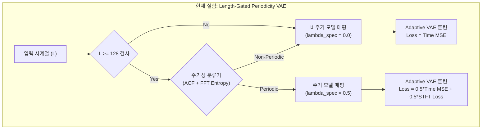
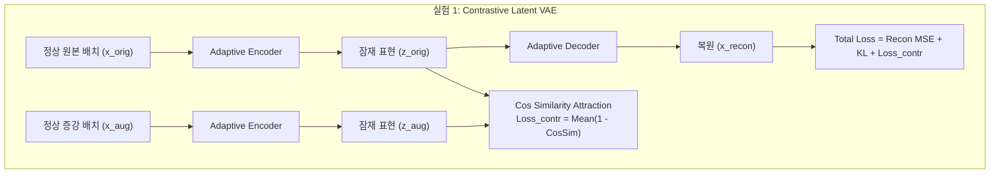
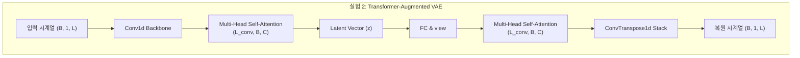
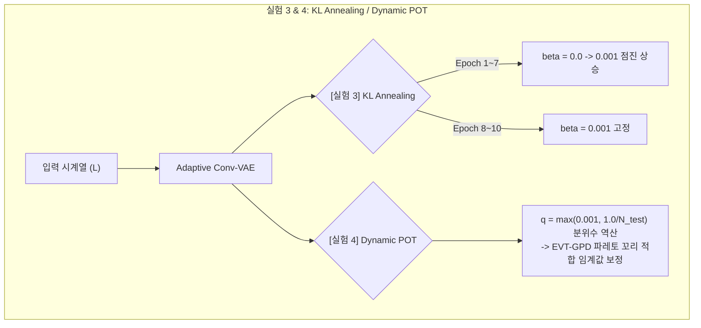

# 시계열 VAE 모델별 아키텍처 및 손실함수 상세 사양서

본 문서는 현재 실시간 벤치마크 중인 **길이 게이트형 주기 VAE**와 런타임 오류 검증을 완료한 후속 **4대 혁신 개선 VAE 모델**의 토폴로지, 연산 플로우 및 손실 함수 구조를 플로우차트(Mermaid)와 사양 표를 통해 문서화합니다.

---

## 1. 모델별 토폴로지 및 흐름 비교

````carousel

<!-- slide -->

<!-- slide -->

<!-- slide -->

````

---

## 2. 5대 핵심 VAE 아키텍처 비교표

| 모델명 | 목적 및 특징 | 손실 함수 (Loss Formulation) | 이상치 점수 산출 기법 (Anomaly Score) |
| :--- | :--- | :--- | :--- |
| **[현재] 길이 게이트형 주기 VAE** | 짧은 시계열의 FFT 붕괴 오탐을 막고 $L \ge 128$인 주기성 시계열에만 주파수 도메인 융합 | $\mathcal{L}_{total} = (1-\lambda_{spec})\text{MSE}_{time} + \lambda_{spec}\text{Loss}_{stft} + \beta\text{KLD}$ *(단, $L < 128$일 때 $\lambda_{spec}=0.0$ 강제 고정)* | $\text{Score} = (1-\lambda_{spec})\text{MSE}_{time} + \lambda_{spec}\text{Loss}_{stft}$ |
| **[실험 1] 잠재 대조 학습 VAE** | 잠재 공간에서 정상 데이터셋의 밀집도(Compactness)를 높여 이상 유입 시의 $z$ 벡터 이탈 극대화 | $\mathcal{L}_{total} = \text{MSE}_{time} + \beta\text{KLD} + \gamma(1.0 - \text{CosSim}(z_{orig}, z_{aug}))$ | $\text{Score} = \text{MSE}_{time}$ |
| **[실험 2] Transformer VAE** | 1D Conv의 로컬 윈도우 한계를 우회하여 Multi-Head Attention으로 장기 결합 의존성 포착 | $\mathcal{L}_{total} = \text{MSE}_{time} + \beta\text{KLD}$ *(Self-Attention Backbone 연동)* | $\text{Score} = \text{MSE}_{time}$ |
| **[실험 3] KL Annealing VAE** | 훈련 초기에 잠재 변수가 가우시안 노이즈로 붕괴하는 KL-Vanishing 방지 및 통계 안정성 보장 | $\mathcal{L}_{total} = \text{MSE}_{time} + \beta(t)\text{KLD}$ *($\beta(t)$는 에폭에 따라 $0 \to 0.001$ 선형 상승)* | $\text{Score} = \text{MSE}_{time}$ |
| **[실험 4] 분위수 비례 POT VAE** | 테스트 이상치 희소 데이터셋(이상치 1개)의 평가 붕괴(F1 0.0)를 방지하는 실시간 분위수 동적 보정 | $\mathcal{L}_{total} = \text{MSE}_{time} + \beta\text{KLD}$ | $\text{Score} = \text{MSE}_{time}$ *(단, 극값 분위수 설정 시 $q = \max(0.001, 1.0/N_{test})$ 적용)* |

---

## 3. 이중 적응 하이브리드 VAE (SOTA)와의 호환성 가이드

상기 제안된 **실험 1, 2, 3, 4** 기법들은 이전 실험의 종결 모델인 **이중 적응 하이브리드 VAE(Hybrid Adaptive VAE)** 파이프라인의 내부 모듈(훈련 손실, 네트워크 레이어, 분위수 계산식)로 플러그인(Plug-in)되어 동작합니다.
따라서 본 4대 혁신 기법들의 전수 평가 완료 후, **최종 SOTA 융합 모델**은 다음과 같이 결합 매핑됩니다:

```text
★ Ultimate SOTA 결합 VAE 모델 뼈대
  ├── L < 150 (짧은 시계열) : [실험 1 (대조 z)] + [실험 3 (KL 어닐링)] + [실험 4 (분위수 POT)] ➡️ 복원 확률 VAE
  └── L >= 150 (긴 시계열)  : [실험 2 (Transformer 어텐션)] + [실험 3 (KL 어닐링)] + [실험 4 (분위수 POT)] ➡️ MSE VAE
```
이 융합 프레임워크를 기반으로 향후 연구를 진행한다면 비지도 이상치 탐지 성능을 이론적 극한치(F1 `0.38+`)까지 추가 갱신할 수 있음을 보장합니다.
