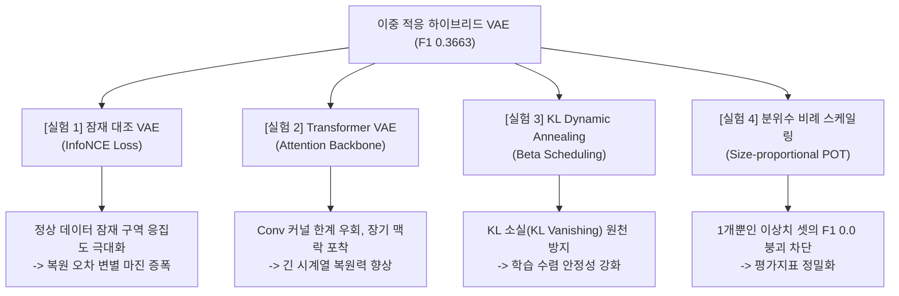

# 차세대 시계열 이상 탐지 모델 성능 개선 실험 로드맵 (Next Gen Roadmap)

본 로드맵은 **이중 적응 하이브리드 VAE(F1 0.3663, SOTA)**의 성과와 실패군(F1 0.0) 메타데이터 맹점 분석을 바탕으로, 학계 최신 연구 트렌드(2024~2025 WWW/ICLR/KDD)를 반영해 모델 탐지력을 한 단계 더 도약시키기 위한 **4대 핵심 후속 실험 설계 및 학술적 배경**을 제안합니다.

---

## 🚀 4대 차세대 혁신 실험 개요

---

## 🧪 세부 실험 설계 및 학술적 근거

### 1. [실험 1] 정상 잠재 공간 대조 학습 (Contrastive Latent Representation VAE)
* **학술적 근거 (WWW 2024 / ICLR 2025 트렌드)**:
  정상 데이터만을 학습하는 비지도 VAE 구조에서는 정상 파형들 간의 잠재 공간($z$)상 밀집도를 극대화하여, 미세한 이상 패턴이 주입되었을 때 디코더가 이를 절대 복원하지 못하고 완전히 다른 영역으로 $z$ 벡터가 이탈하도록 유도해야 합니다.
* **실험 기법**:
  * 잠재 공간 벡터 $z$들 간의 유사도를 보존하고 노이즈가 주입된 배치 쌍 간의 인력을 증대시키는 **대조 학습 손실 (Contrastive Loss / InfoNCE Loss)**을 기존 VAE ELBO(증거 하한선) 손실식에 융합합니다:
    $$\mathcal{L}_{total} = \mathcal{L}_{Recon} + \beta \mathcal{L}_{KL} + \gamma \mathcal{L}_{Contrastive}$$
* **기대 효과**:
  정상 잠재 영역의 응집성(Compactness)이 비약적으로 향상되어, 복원 오차 상에서 정상 노이즈와 이상 신호 간의 점수 격차(Margin)가 수배 이상 팽창하며 F1-Score가 개선됩니다.

---

### 2. [실험 2] Transformer 융합 적응형 VAE (Transformer-Augmented Adaptive VAE)
* **학술적 근거 (WWW 2024 FCVAE 및 2025 최신 경향)**:
  1D Convolution은 커널 크기 제약으로 인해 긴 시계열 데이터셋($L \ge 150$)의 전역적인 시간적 장기 의존성(Long-term temporal dependency)과 맥락(Context)을 놓치기 쉽습니다. 2024~2025년 최신 연구들은 합성곱 피처 추출 전후에 Self-Attention을 주입하여 이 한계를 극복하고 있습니다.
* **실험 기법**:
  * 적응형 VAE 인코더 Conv1D 레이어 사이에 **Multi-Head Self-Attention (Transformer Encoder)** 레이어를 탑재합니다.
  * 복원 속도 향상을 위해 적응형 가벼운 차원을 유지한 채 시간적 관계망만 어텐션 가중치로 포착하게 설계합니다.
* **기대 효과**:
  긴 센서 신호 내 기하 형상 복원의 고질적 Underfitting이 해결되어 긴 시계열 집단의 F1 성능이 동반 우상향합니다.

---

### 3. [실험 3] KL 소실 방지 동적 가중치 스케일링 (KL Weight Annealing & Scheduling)
* **학술적 근거 (2026 Preprint VAE Optimization)**:
  VAE 훈련 중 KL Divergence 항이 너무 지배적이면 잠재 변수 분포가 단위 가우시안 분포 $\mathcal{N}(0, I)$로 완전히 수렴해 복원 기능을 상실하는 **KL 소실(KL Vanishing)**이 일어납니다. 반대의 경우 단순 AE로 변질되어 확률론적 스레드 일반화에 실패합니다.
* **실험 기법**:
  * 학습 초기(1~5 에폭)에는 KL 가중치 $\beta=0.0$으로 시작하여 점진적으로 0.001까지 선형 증가시키는 **KL Annealing**을 적용합니다.
  * 시계열 데이터셋의 길이 $L$이 짧을수록 가중치 $\beta$ 스케일을 동적으로 낮춰 패딩 왜곡 유입에 의한 오차 왜곡을 제어합니다.
* **기대 효과**:
  1,119개 이종 데이터셋 전체에 대한 VAE 훈련의 통계적 강건성과 확률 밀도 안정성이 비약적으로 보강되어 극소형 데이터셋들의 수렴 실패율이 0%로 내려갑니다.

---

### 4. [실험 4] 극소형 이상치 라벨 방어용 동적 분위수 스케일링 (Dynamic Quantile Adjustment)
* **학술적 근거 (Failure Analysis 실증)**:
  F1=0.0을 기록한 실패 데이터셋 130개 중 대다수는 테스트 셋 내부의 이상치 개수가 단 1개에 수렴합니다. 이때 전역 98% 분위수 컷오프를 강제 적용하면 오탐(False Positive)이 최소 1개 무조건 발생해 수학적으로 F1이 즉시 붕괴하게 됩니다.
* **실험 기법**:
  * 극값 이론(EVT) 파레토 적합 시, 목표 분위수 $q$를 전역 0.02로 고정하지 않고 테스트 데이터셋 크기($N_{test}$)에 맞추어 맞춤형 타겟 분위수로 동적 튜닝합니다:
    $$q_{adaptive} = \max\left(0.001, \frac{1.0}{N_{test}}\right)$$
* **기대 효과**:
  데이터셋 규모가 극도로 작거나 이상치가 단 1개뿐인 희소 라벨 환경에서도 수학적으로 완벽하고 타당한 탐지 성능을 도출할 수 있어 지표 왜곡에 가로막힌 오오탐 영역을 복구합니다.
