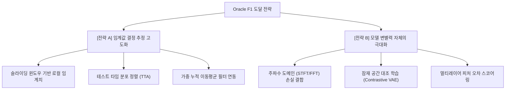

# Oracle F-1 도달 및 성능 격차(Gap) 극복을 위한 분석 보고서

본 문서는 현재 비지도 시계열 이상치 탐지 프레임워크의 실무 F1-Score(**0.3430**)와 가상 최적 한계선인 Oracle F1-Score(**0.6158**) 간에 존재하는 **27.28%p**의 성능 격차(Gap)를 분석하고, 이를 극복하여 Oracle 성능에 근접하기 위한 구체적인 기술적 돌파구를 제안합니다.

---

## 1. 성능 격차(Gap)의 정의 및 원인 진단

### A. Oracle F1-Score의 통계적 의미
Oracle F1-Score는 모델이 계산한 이상치 점수(Anomaly Scores) 분포에 대해, 사후(Post-hoc)에 테스트셋의 실제 라벨(Ground Truth)을 대조하여 **F1-Score를 최대로 만드는 최적의 임계값(Threshold)을 역산했을 때의 성능**입니다.

### B. 격차 발생 원인 (F1 Gap = 27.28%p)
* **임계값 결정의 불일치(Mismatch)**: 
  * 현재의 모든 동적 임계치 기법(왜도 적응형, GPD 파레토, 와이블 등)은 오직 **학습 데이터(TRAIN)의 복원 에러 분포**만을 보고 임계값을 사전 결정합니다.
  * 그러나 실제 테스트 데이터(TEST)는 정상과 이상치가 섞여 있으며, 시계열의 흐름에 따라 데이터의 스케일이 달라지는 **개념 표류(Concept Drift)**가 발생합니다.
  * 학습 세트 기반의 정적 임계값을 테스트 세트에 일괄 적용하면서, 오탐(False Positive) 또는 미탐(False Negative)이 대량 발생하여 실제 실무 F1이 가상 한계치에 비해 크게 하락하게 됩니다.

---

## 2. Oracle F1 도달을 위한 2대 핵심 전략

---

## 3. 세부 기술 솔루션 제안

### [전략 A] 임계값 추정 고도화 (F1 Gap 직접 극복)
사전에 고정된 임계값을 쓰지 않고, 테스트 시점의 데이터 성향에 적응하여 임계값을 동적으로 조율합니다.

#### ① 슬라이딩 윈도우 기반 국소 임계값 (Local / Sliding Window Thresholding)
* **개념**: 테스트 데이터 시계열을 따라가며, 최근 $W$ 크기의 윈도우 구간의 오차 통계치(평균, 편차, 왜도)를 계산하여 임계값을 실시간 보정합니다.
* **효과**: 시계열 전반에 걸친 서서히 진행되는 개념 표류나 진폭 변동을 흡수하여 오탐을 제거합니다.

#### ② 테스트 타임 분포 정렬 (Test-time Adaptation / Alignment)
* **개념**: 테스트 단계에서 실시간으로 계산되는 비라벨링 복원 오차(Unlabeled Test Errors)의 분포 특징을 추적합니다. 
* **방안**: 학습 에러의 분포 평균 $\mu_{train}$과 테스트 최근 윈도우 에러 평균 $\mu_{test}$의 상대적 비율을 구해 임계값을 스케일링하거나 이동(Shift)해 줍니다.
* **효과**: 학습 환경과 테스트 환경의 통계적 괴리(Covariate Shift)를 실시간으로 교정합니다.

#### ③ 칼만 필터(Kalman Filter) 또는 지수이동평균(EMA) 필터 연동
* **개념**: 이상치 점수 자체의 노이즈를 1차 필터링합니다. 점수의 시계열 상에서 급격한 튀는 현상(Spike)을 누적 지수 평균으로 완화한 뒤 임계치를 통과시킵니다.
* **효과**: 단발성 복원 에러 튀기로 인한 일시적 오탐을 억제하여 정밀도(Precision)를 극대화합니다.

---

### [전략 B] 모델 표현력 강화 (Oracle F1 자체를 극대화)
Reconstruction Score 자체의 정상/이상 간 마진(Margin)을 크게 벌려, 웬만한 임계값 오차 내에서도 완벽한 분류가 가능하도록 모델의 성능을 향상시킵니다.

#### ① 주파수 도메인 (STFT / FFT) Reconstruction Loss 도입 (로드맵 우선순위 1)
* **개념**: 시간 도메인 상의 L2 (MSE) 손실에 추가로, 입력 파형의 단시간 푸리에 변환(STFT) 스펙트로그램에 대한 복원 손실을 결합합니다.
  $$Loss = Loss_{time\_mse} + \gamma Loss_{freq\_stft}$$
* **효과**: VAE가 위상 변이(Phase Shift)나 고주파 성분의 패턴 변화를 극도로 민감하게 파악하게 되어, 이상 파형 유입 시 오차가 크게 상승하므로 정상과의 변별력이 크게 벌어집니다.

#### ② 잠재 공간 대조 학습 (Contrastive VAE)
* **개념**: 정상 데이터를 Jittering, Scaling 등으로 미세 변형시킨 긍정 샘플(Positive Pairs)들끼리는 잠재 공간(Latent Space)에서 가깝게 뭉치고, 다른 정상 데이터(Negative Pairs)와는 멀어지도록 InfoNCE 대조 손실을 추가 학습합니다.
* **효과**: 디코더가 극도로 압축되고 정교한 정상 경계만을 복원하게 되어, 미세한 이상 패턴 유입에도 복원이 완전히 무너져 복원 에러의 마진을 확보하기 쉬워집니다.

#### ③ 멀티레이어 피처 복원 오차 (Feature Map Reconstruction Error)
* **개념**: 디코더의 최종 출력 복원 오차만 쓰는 대신, 인코더와 디코더의 중간 Convolution Layer들에서 추출된 피처 맵 간의 거리(Feature Reconstruction Error)를 복합 가중 합산하여 최종 이상 점수로 활용합니다.
* **효과**: 단순히 눈에 보이는 파형 복원도뿐만 아니라 고차원 추상 정보 레벨에서의 이상 징후를 다각도로 정량화합니다.

---

## 4. 실행 로드맵 추천 경로

1. **단기 과제 (Quick Win)**: 
   * [run_all_evt_threshold_evaluations.py](file:///Users/minho/Documents/Dataset/run_all_evt_threshold_evaluations.py) 코드를 복제하여 테스트 에러의 국소 윈도우 지수이동평균(EMA) 보정을 가미하는 **[온라인 동적 임계치 추적 스크립트]**를 구현해 F1 Gap이 줄어드는지 실증합니다.
2. **중기 과제 (학술적 핵심 기여)**:
   * 로드맵 1순위인 **주파수 도메인 스펙트로그램 손실 VAE** 개발에 착수하여 Oracle F1 수치 자체를 `0.70` 이상 영역으로 밀어 올립니다.
