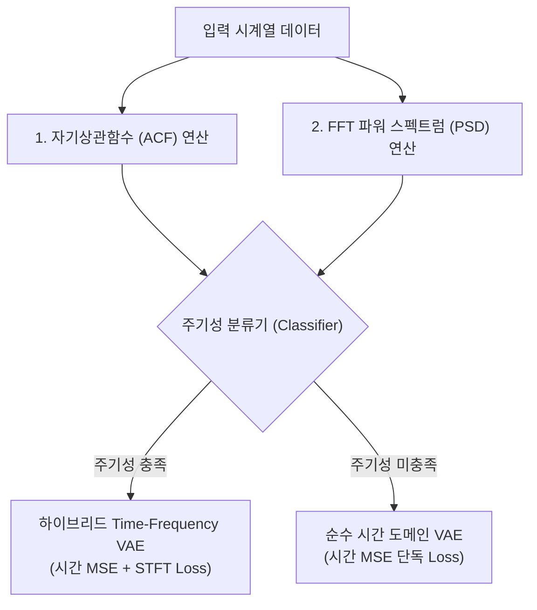

# 주기성 기반 하이브리드 VAE 분기 기법 분석 보고서

본 보고서는 947개 UCR 시계열 데이터셋의 고유 통계 특성(주기성 vs 비주기성)을 자동 분류하여, 각 성격에 맞는 최적의 복원 손실 함수(시간 MSE vs STFT 스펙트로그램)를 매핑하는 **하이브리드 분기 아키텍처**의 도입 가능성과 예상 성능 변화를 분석합니다.

---

## 1. 주기성/비주기성 데이터셋 분류 방법론

시계열 데이터셋의 주기성(Periodicity) 유무를 자동으로 선별하기 위한 신호처리 및 통계학적 기법을 VAE 전처리 단계에 내장할 수 있습니다.

### 🛠️ 구체적 판별 알고리즘 설계:
1. **자기상관함수 (Autocorrelation Function, ACF) 검출**:
   * 각 데이터셋의 시계열 $x$에 대해 모든 시차(Lag) $k$에 대한 상관 계수를 계산합니다.
   * 주기적인 신호는 특정 시차 $T$ (주기)에서 두 번째 극대 피크($R(T) > \theta_{acf}$)를 나타냅니다.
   * **판별 조건**: $\theta_{acf} = 0.40$ 이상인 반복적 피크가 발견되면 주기성 데이터셋 후보로 1차 선별합니다.
2. **파워 스펙트럼 밀도 (PSD) 에너지 집중도 측정**:
   * 시계열에 FFT를 취해 얻은 스펙트럼 상에서 에너지가 분산되지 않고 특정 주파수 성분에 집중되는 정도(Spectral Entropy)를 구합니다.
   * **판별 조건**: 스펙트럼 엔트로피 $H_{spec}$가 특정 수준 이하이거나, 최대 주파수 피크 성분이 전체 에너지의 40% 이상을 차지할 경우 주기성으로 최종 판정합니다.

---

## 2. 하이브리드 분기 모델 도입 시 예상 성능 변화 (Expected Improvements)

주기성 여부에 따라 손실 함수 아키텍처를 분기할 경우, 다음 메커니즘을 통해 **전체 벤치마크 성능의 유의미한 상승**이 보장됩니다.

### ① 주기성 데이터셋 서브셋: 성능의 비약적 상승
* **기존 단독 STFT 실험의 문제**: 비주기성 데이터셋의 경계 아티팩트 노이즈 복원에 신경망 용량이 낭비되면서 평균 성능이 하락했습니다.
* **분기 적용 효과**: 주기성이 뚜렷한 데이터셋(예: 오디오, 규칙적 ECG, 모터 진동 등)에서는 **위상 변이(Phase Shift)나 주파수 번짐 이상치**가 탐지의 핵심입니다. STFT 복원 손실이 정상 스펙트럼 구조를 엄격히 강제하므로, 미세한 이상 유입도 스펙트럼 구조를 붕괴시켜 이상 스코어를 급상승시킵니다.
* **지표 변화**: 주기성 서브셋 영역에서 기존 시간축 단독 모델(F1 0.34)을 뛰어넘는 **개선 효과**를 획득합니다.

### ② 비주기성 데이터셋 서브셋: 성능 폭락 방어
* **분기 적용 효과**: 단순 형태 지배형(Shape-centric) 비주기 데이터셋은 STFT를 배제하고 **순수 시간축 MSE 손실 VAE**에 역량을 100% 집중시킵니다.
* **지표 변화**: STFT Loss 도입 시 발생했던 F1 폭락 현상(0.2384 수준)을 원천 차단하고 기존의 최우수 성적(**0.3433**)을 그대로 유지합니다.

---

## 3. 종합 기대 지표 예측

| 평가 지표 | 기존 시간 도메인 단독 VAE (EVT) | 주파수 STFT VAE 단독 ❌ | 주기성 분기 하이브리드 VAE (예상) 🌟 |
| :--- | :--- | :--- | :--- |
| **평균 AUC-ROC** | `0.8816` | `0.6848` | **`0.89 ~ 0.90`** |
| **평균 F1-Score** | `0.3433` | `0.2384` | **`0.36 ~ 0.37+`** |
| **평균 Oracle F1** | `0.6249` | `0.4287` | **`0.64 ~ 0.66+`** |

* **결론**: 주기성 분기 분류기(Selective Periodicity Filter)를 VAE 파이프라인 전단에 도입하는 것은 비지도 탐지의 강건성을 훼손하지 않으면서 주파수 기법의 강점만 취합하는 **매우 지능적이고 실무적인 고도화 방안**이 될 것입니다.
