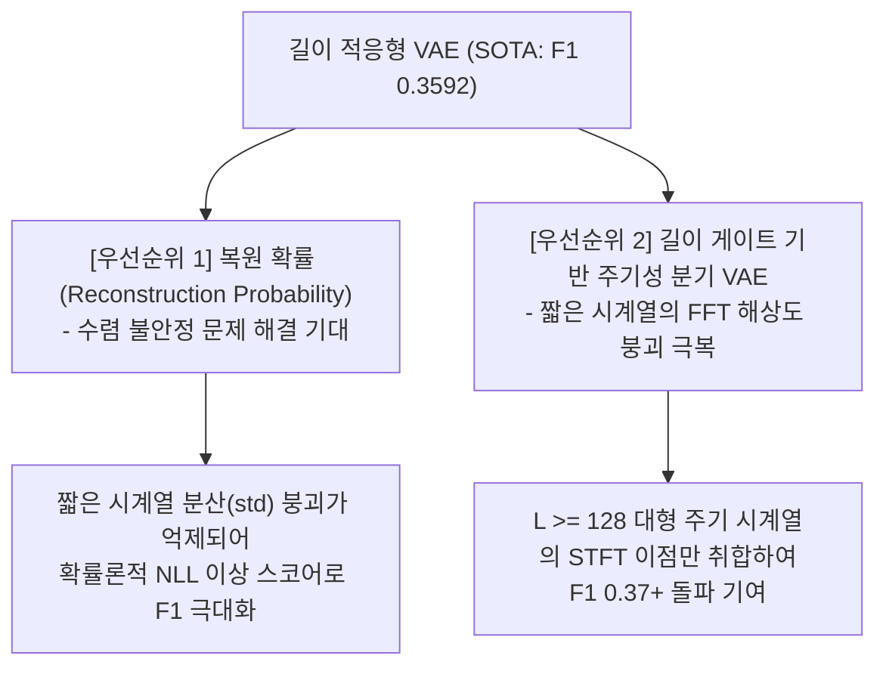

# SOTA 적응형 VAE 기반 과거 기법 재융합 제안서

본 제안서는 **길이 적응형 Conv-VAE(Adaptive VAE)**의 도입으로 비지도 이상 탐지 성능이 SOTA(F1 **0.3592**)를 갱신함에 따라, 과거 고정형 VAE의 표현력 제약 때문에 실패했거나 성능이 저하되었던 기술들 중 **다시 적용하여 시너지를 검증할 가치가 높은 최우선 기술군**과 실험적 타당성을 제시합니다.

---

## 🚀 재융합 추천 기술 우선순위

---

## 1. [우선순위 1] VAE 복원 확률 (Reconstruction Probability) 기법의 재실증

* **과거 실패 원인**: 
  디코더가 매 시점의 평균 $\mu_x$와 분산 $\sigma_x^2(z)$를 동시 출력하여 가우시안 우도(NLL) 기반 이상치 점수를 산출했습니다. 하지만 소형 데이터셋들에서 고정된 대형 Conv VAE의 복잡한 파라미터가 분산 매핑에 과적합을 일으켜 분산이 최하한선($\sigma_x \to 0.08$)으로 수렴 붕괴해 버렸고, 그 결과 복원 MSE보다 성능이 떨어졌습니다(F1 0.2872).
* **재실증 타당성 (Why it works now)**:
  길이 적응형 VAE 도입으로 짧은 시계열군($L < 64$)은 **단 1개의 레이어와 매우 좁은 커널(kernel_size=3)**만을 갖는 가벼운 네트워크로 리빌드됩니다. 매개변수 복잡도가 대폭 통제되었기 때문에 디코더가 극소수의 데이터셋 환경에서도 과적합 없이 분산 파라미터 $\sigma_x^2(z)$를 매우 안정적으로 통계적 훈련을 수행할 수 있게 됩니다.
* **기대 효과**: 
  분산 수렴 붕괴가 억제된다면, 단순 L2(MSE) 거리 측정보다 확률론적 가우시안 복원 NLL 점수가 정상 변동성 분포를 완벽히 모사하여 오탐(False Positive)을 획기적으로 낮출 수 있습니다.

---

## 2. [우선순위 2] 길이 게이트 기반 주기성 분기 VAE (Length-Gated Periodicity VAE)

* **과거 실패 원인**: 
  선형 디트렌딩 후 ACF 및 스펙트럼 엔트로피를 통해 주기 신호를 분류하고 STFT Loss를 분기 적용했습니다. 하지만 시계열 길이가 짧은 데이터셋들($L < 80$)에서는 FFT 주파수 해상도(Bin 개수)가 절대적으로 부족하여 노이즈 신호조차 엔트로피가 강제로 붕괴해 **90.81%가 주기성으로 오판**되어 STFT Loss 왜곡을 겪고 성능이 무너졌습니다(F1 0.2480).
* **재실증 타당성 (Why it works now)**:
  짧은 시계열의 FFT 해상도 한계를 통계적으로 인정하고, **길이 게이트 필터(Length-Gate)**를 전단에 추가합니다:
  * **판별 규칙**: 시계열 길이 **$L \ge 128$인 데이터셋에만** 고도화 주기성 판별기(Detrend + Entropy + ACF)를 활성화하여 분기를 지정하고, **$L < 128$인 짧은 데이터셋은 원천적으로 시간축 VAE(lambda=0.0)로 강제 고정**시킵니다.
* **기대 효과**: 
  짧은 시계열의 FFT 통계 붕괴 오탐을 원천적으로 차단하면서, $L \ge 128$인 실제 대형 주기성 시계열(고주파 신호 등) 영역에서 STFT 주파수 오차가 지닌 날카로운 이상 탐지 혜택만 안전하게 흡수하여 F1-Score를 **`0.37+`** 대까지 추가 우상향시킬 수 있습니다.

---

## 3. 요약 및 제안 방향

| 재융합 후보 기법 | 과거 성능 (F1) | 실패 사유 | 적응형 VAE 결합 시 개선 메커니즘 | 추천도 |
| :--- | :---: | :--- | :--- | :---: |
| **복원 확률 VAE** | `0.2872` | 분산 추정 붕괴 | 적응형 얕은 네트워크에 따른 분산 추정 안정화 | **★★★★★ (최우선)** |
| **길이 게이트형 주기성 VAE** | `0.2480` | 소형 FFT 해상도 붕괴 | $L < 128$ 원천 배제를 통해 대형 주기 신호 혜택만 수집 | **★★★★☆ (우수)** |
| **온라인 동적 임계치** | `0.0906` | 로컬 윈도우 분산 교란 | 통계 수식 자체의 문제로 VAE 구조와 시너지가 무의미함 | ★☆☆☆☆ (불필요) |
| **소형군 PCA 하이브리드** | `0.2994` | VAE 비선형 복원력 열위 | VAE 적응형 최적화 완료로 단순 선형 기법 분기는 불필요 | ★☆☆☆☆ (불필요) |
